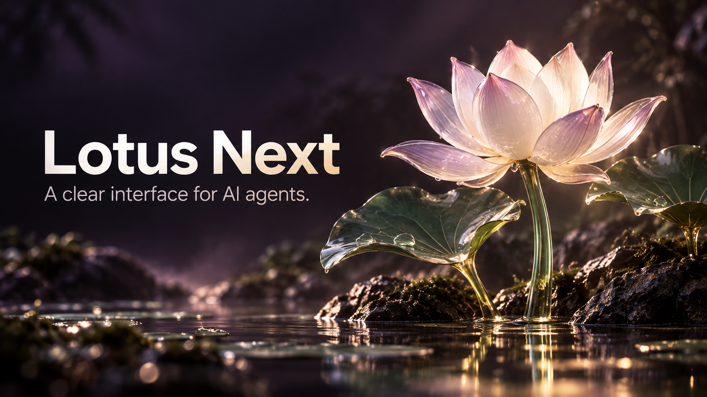

# Lotus Next



*Brand illustration, not a software screenshot. The lotus symbolizes clarity and beauty.*

**Follow your agent's work from a browser or the Bodhi desktop app.** Lotus Next is the React interface for [Bamboo](https://github.com/bigduu/Bamboo-agent), the core of the [Zenith](https://github.com/bigduu/Zenith) local AI agent harness suite. It puts conversations, tool activity, permission requests and runtime settings in one place.

Use the browser interface when you already run Bamboo, or install [Bodhi](https://github.com/bigduu/Bodhi-AI/releases/latest) for a desktop shell that manages the engine. Lotus Next supplies the UI; Bamboo runs the agent and connects to your configured model provider and tools.

## What you can do

- **Follow a task as it happens:** read streaming responses, reasoning and tool activity, and respond to approval or question dialogs.
- **Keep project conversations organized:** switch sessions, preserve drafts and export a conversation as Markdown or PDF. A desktop split view supports a second interactive chat pane.
- **Configure the tools behind the conversation:** open settings for providers, MCP servers, plugins, skills and permissions, plus runtime features such as workflows and schedules where supported by the connected Bamboo version.
- **Work at different screen sizes:** use responsive desktop/mobile layouts, light/dark/system themes and a graphics-safe mode for constrained environments.

These describe the source checkout, not a guarantee that every connected backend or older packaged app has the same capabilities. Settings screens do not themselves supply provider credentials, an MCP server or a running scheduler.

## See a project prepared for a task


[Static image](docs/demos/project-workspace.png) · [Recording and reproduction](docs/demos/README.md)

Real browser recording against a real Bamboo backend at the audited source pins.
It uses an empty temporary workspace; no model is called and no task completion
is implied. This is source behavior, not acceptance of the published desktop app.

## Try it from source

Requirements: Node.js **22.12+**, npm, and a compatible Bamboo server. Start Bamboo separately using its [setup instructions](https://github.com/bigduu/Bamboo-agent#readme), with the API listening on `127.0.0.1:9562`. Then, in this directory:

```bash
npm ci
npm run dev -- --host 127.0.0.1
```

Open **http://127.0.0.1:9563**. On a fresh backend, finish `bamboo init` first; the initial setup gate directs you to backend/desktop configuration. Open **Settings → Providers** to configure a provider if your Bamboo instance does not already have one. Start with a small task in a sample workspace, then follow the tool activity and any approval prompts.

The explicit host option keeps this development server on loopback; the repository's unqualified `npm run dev` listens on the network. Vite proxies `/api` and `/v2` to Bamboo on port `9562`. An unavailable backend cannot execute tasks or provide server-backed settings.

For a production artifact:

```bash
npm run build
# In a separate shell with Bamboo installed:
bamboo serve --static-dir /absolute/path/to/lotus-next/dist --port 9562
```

Open **http://127.0.0.1:9562** when Bamboo is ready. This uses the frontend you just built. The published npm package contains frontend assets, not a standalone agent or CLI.

## Source, npm package and desktop release

Lotus Next is the canonical UI used by current Bamboo/Bodhi source consumers. The old Lotus frontend is retained as an explicit rollback path in those consumers, rather than the default production frontend.

Checked on 2026-10-03:

| Layer | Verified identity |
|---|---|
| Zenith pin and observed upstream `main` | `1131c275cb441694a41f996228d9f91473d920f5` |
| npm `latest` | `@bigduu/lotus-next@2026.9.22`, source `a480e2bb94f5dd08fe4b01b2f8844a2c9ed03245` |
| Latest public Bodhi installer | `app-v2026.9.20`, locking Lotus Next `2026.9.16` |

The source has changes after the npm artifact, including actor-stream/continuity and workflow-selection work. Those source changes are **not** asserted to be in `2026.9.22` or the desktop installer. Source `package.json` intentionally keeps `0.0.0`; publishing and consumer adoption are separate steps. See the [version audit](docs/readme-audit.md) for evidence.

## Runtime and localization

The UI uses canonical `/api/v1` REST calls and one shared `/v2/stream` WebSocket (JSON by default, opt-in MessagePack). Browser builds and the Tauri runtime adapter choose the backend endpoint; serving static files alone does not replace Bamboo.

`VITE_BACKEND_BASE_URL` and new browser endpoint overrides accept a bare HTTP(S) origin or exact `/api/v1`. Do not use the legacy `/v1` alias. Keep credentials out of public `VITE_*` build variables. Prefer serving the production UI from Bamboo's origin; remote hosting requires the appropriate backend authentication and secure transport setup.

The i18next runtime registers `en-US`, `zh-CN`, `zh-TW`, `fr-FR`, `ja-JP` and `hi-IN`, loaded on demand with `en-US` fallback. Some newer screens still contain hard-coded Chinese text; this is not a claim of complete localization.

## Develop and verify

```bash
npm run type-check
npm run test:run
npm run verify
npx playwright install chromium
npm run test:e2e:built
```

`verify` checks types, lint, unit tests, architecture, the build and package contents. The browser suite exercises that output at desktop, tablet and phone viewports. Its deterministic fixtures are separate from the real-Bamboo acceptance lanes; neither is a claim of physical-device or public-network testing.

See [verification and packaging](docs/verification.md) for isolated real-runtime tests, immutable published-artifact checks and manifest verification, and [bundle baseline](docs/bundle-baseline.md) for measured build context. These are contributor checks, not prerequisites for installing Bodhi.

## License

Project-owned code and documentation are licensed under the [MIT License](./LICENSE).
Third-party components retain their respective licenses and copyright notices.
