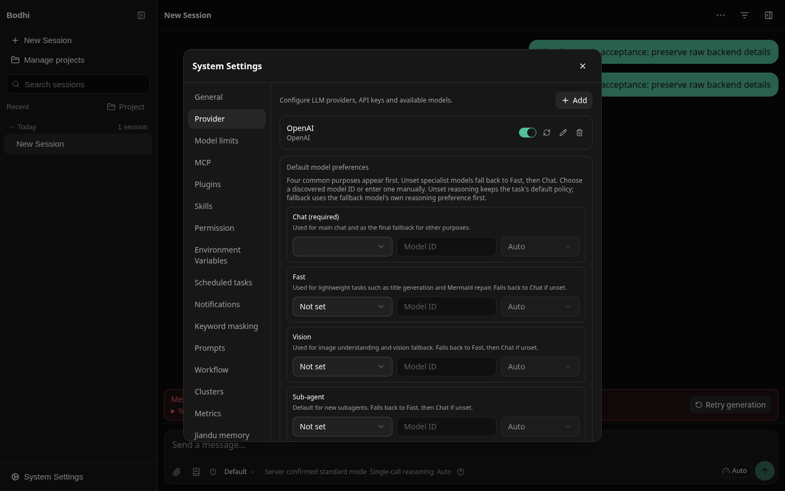
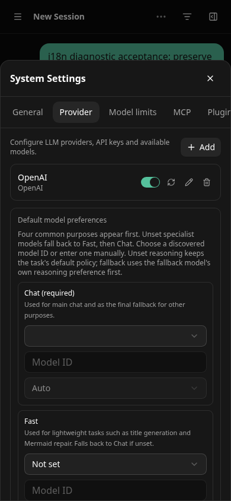
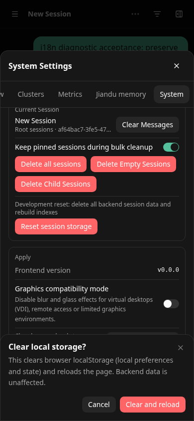
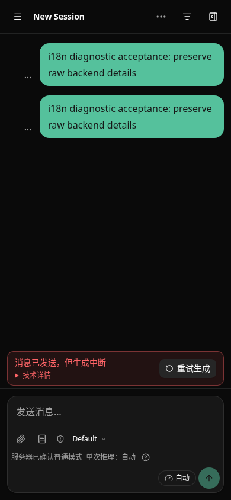
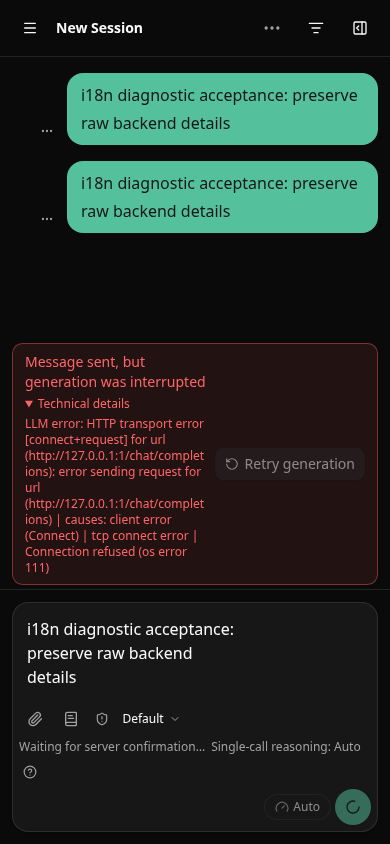

# English interface coverage

The General settings page restores the existing language preference. The application reuses i18next/react-i18next, the existing lazy locale resources, and `lotus_ui_locale_v1`; it adds no dependencies or second settings system.

## Locale behavior

A valid saved locale wins over `navigator.language`. Existing browser detection recognizes Chinese variants, French, Japanese and Hindi; other browsers default to `en-US`. `en-US` remains the missing-key fallback. Simplified Chinese application copy remains available. The other existing locale choices/resources are preserved, with English fallback for newly covered keys that have no translation in those languages. This change only supplies English and Simplified Chinese application catalogs.

Locale changes subscribe existing components without remounting the composer. Successful selections are saved; storage failures do not prevent switching. The newest concurrent lazy selection wins. Failed resource loads can be retried. React startup waits for locale initialization; `document.documentElement.lang` follows the chosen locale. The dependency-free catastrophic startup screen in `src/main.tsx` independently selects English/Chinese and retains raw diagnostics.

## Coverage checklist

| Surface | Covered application copy and verification |
| --- | --- |
| Navigation and sessions | Sidebar, search, projects, session actions, date groups, toolbar and inspector; names stay verbatim. |
| Composer and workflows | Placeholders, accessible names, attachments, workflow selection, queued guidance, permission/reasoning states, goals and notifications; existing composer #219 retained. |
| Messages and approvals | Tool presentation, question/approval controls, notices, empty/error states and technical-detail wrappers; raw model/tool output stays verbatim. |
| General and model/tool settings | Language, appearance, experience mode, providers/model preferences, model limits, MCP, plugins, skills, permissions, environment variables and masking. |
| Advanced settings | Prompts, workflows, schedules, clusters, metrics, Jiandu memory, notification configuration and system confirmation dialogs. |
| Validation and failures | Frontend-owned validation and recovery text; existing known-error guidance; backend error text is retained for diagnosis rather than replaced with fabricated translations. |
| Supervisor Tickets | Work/request status, question/approval actions, receipt recovery, artifacts and references; work titles, questions, answers, action data and evidence stay verbatim. |
| Formatting and accessibility | Interpolated complete phrases, English singular/plural counts, locale calendar/relative-time/number formatting, labels and document language. |

Started from main `a02163700edff8c2fd50977b3e3858be53960998`, after composer #219. Supervisor #220 was still unmerged then. When main advanced to merged `6e6bd0d277502c7e56f085d51762072ab9bb5fa4`, this branch merged main and localized the new Ticket surfaces without changing their admission, generation, receipt or approval behavior. No unmerged Supervisor branch was imported; there are no outstanding #220-only localization integration points on this base.

## Executable-copy audit and retained literals

`npm run i18n:check` checks both catalog keys and interpolation placeholders, typed literal `uiText` lookups, and Chinese executable literals across `src`. The current catalogs have **1,812 matching keys**. Existing English was retained or reused rather than treated as missing. The audit excludes locale resources and test data; it is not a claim that arbitrary backend/user text can be translated.

Intentionally retained locations:

- `src/components/chat/Settings.tsx`: native-language autonyms in the selector (`简体中文`, `繁體中文`, `日本語`).
- `src/main.tsx`: dependency-free bilingual catastrophic-startup copy, before React or locale resources are available.
- `src/services/tickets/testFixtures.ts`, `src/test`, and test files: representative raw Chinese user/backend data used to assert preservation.
- `src/lib/taskTemplates.ts`: existing English model instructions remain identical; only UI titles/descriptions use the locale catalog.
- Chat/message/ticket views and service failure paths: runtime names, prompts, code, tool payloads, backend errors, operation IDs, permissions and artifact content remain raw. Existing English protocol/product terms and identifiers are retained.

Comments are not interface copy. Literal audit cannot prove every runtime backend path; backend-native diagnostics and negotiated feature availability remain backend concerns.

## Verification and evidence provenance

Local cloud source `fb6fe49d85322cd46549914962cfdfffd21a4742`: **2,129 tests across 126 files** passed, including locale key/placeholder parity, browser/saved/default detection, missing-key fallback, concurrent switching, blocked storage, persistence, plurals/calendar groups, dynamic labels, raw-content preservation and Ticket switching with the same answer input. Type, lint, architecture, build and package checks passed. Package budgets are unchanged. Authenticated GitHub Git Data upload preserves each local tree exactly; published commit IDs have different metadata, and are not relabelled as separately executed local tests.

`e2e/i18n.spec.ts` exercises both initial languages on desktop/tablet/phone, switching/reload persistence, IME Enter suppression, preserved draft, model settings, cancelable confirmation and layout overflow. This suite uses deterministic fixture transport, explicitly separate from the real evidence below. Fixed-build focused browser verification passed **21/21** (all six bilingual cases plus the all-surface contracts). An earlier complete local sweep had 139 passes, 72 skips and two failures after a concurrent rebuild removed a settings chunk referenced by an already loaded page; that sweep is not claimed green. The affected scenarios passed the fixed-build rerun. Exact published-head Node 22/24 CI runs the complete built browser suite as well as `npm run verify`.

The screenshot acceptance script `scripts/i18n-real-browser.mjs` connects to an actual separately provisioned Bamboo HTTP process. It uses no `route.fulfill`, synthetic provider or mocked transport. Bamboo source: `2f393c92da8ef592fa1bce19106bc82a4ebf194d`. The provider deliberately points to unavailable `http://127.0.0.1:1`; no live-model success is claimed. It creates a diagnostic session only in its isolated data directory, checks both locale selections and reloads, verifies identical textarea identity and IME draft, checks 390px width, cancels the system dialog, and triggers a genuine backend connection-refused error while displaying the raw diagnostic. Zero browser page errors.

Provisioning note: the backend's combined setup write returned `a compatibility write changed multiple sections (core, providers)`. The isolated test setup was marked complete via the canonical core-section API with its revision precondition. This pre-existing setup write limitation was not modified or presented as localized backend behavior.

Real screenshot captures below are from the verified application source `fb6fe49` above, before the later review corrections, with animations disabled; desktop long English settings labels wrap. They do not use fixture-generated backend data.







## Review corrections

The GitHub review found and this branch fixes: preferred locale chunk failure blocking startup despite available English, ambiguous reasoning “Close” (now “None”, while close buttons stay “Close” and notification disabling is “Off”), the application noun “Apply” (now “Application”), mixed punctuation in schedule deletion (now one interpolated question), and output rates using the browser locale (now the selected UI locale). The focused four-file regression suite passed39/39, including a failing Chinese bundle with English startup and saved-choice recovery, unchanged close controls, raw schedule names, and French/English output-rate formatting. A real browser transport regression blocks the Chinese chunk and checks English mounting followed by Chinese recovery on reload: **1/1 passed**. Type/lint/build/package checks passed at local review-fix source `b7db725b09b27e91628628f3661be4d88d1dcfff`; startup JS1,448,385 raw/438,833 gzip and CSS105,801 raw/17,187 gzip remain within unchanged budgets. Earlier screenshot/test sources retain their provenance; final exact-head CI validates the review corrections.

The subsequent review identified metrics count omission, permission/example and grouped-tool punctuation, a stale mismatch-label memo, the empty-goal action noun, and existing browser errors retaining their earlier language. These are corrected locally at `0136a6b`; focused regression **87/87** passed across six files, including locale changes with the identical breakdown object, raw browser cause and unchanged browser-open count, and tool labels/names. Shared list formatting keeps the original Chinese compact delimiter and uses Intl formatting elsewhere. Numeric context/cache/metric tooltips now use the UI locale; complete resource phrases retain Chinese punctuation only in Chinese. The executable audit also rejects Chinese punctuation in English resources and plural call sites without count. Earlier real screenshot provenance remains unchanged.

Further reviewed labels now distinguish the Enable action from Enabled state, Pinned section headings from Pin actions, and the singular current Root session. Local source `891ea0ce439fcc8b6c24a18f656aa25b4a182bec`: the six-file focused label/context/group/MCP suite passed **33/33**, including an actual unchecked MCP switch with accessible name Enable. Type/lint/build/package checks pass; startup JS1,458,043 raw/442,540 gzip and CSS105,801 raw/17,187 gzip remain within the unchanged budgets. Earlier exact published head `d2d8b2b` passed both Node22/24 CI; it is not claimed to validate these later corrections. Final published-head CI/review remains the merge gate.

## Reproduce

```sh
npm ci
npm run verify
npm run test:e2e:built
# Serve built dist with a separately provisioned real Bamboo data directory:
LOTUS_I18N_BASE_URL=http://127.0.0.1:9573 node scripts/i18n-real-browser.mjs
```

The opt-in real script creates a diagnostic session and attempts a generation on that isolated backend. Do not point it at production user data. GUI/OS-level IME composition, other locale translations, live-model semantic evaluation, deployment and release are outside this change.
